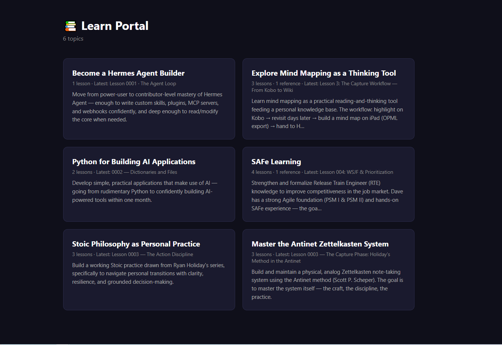
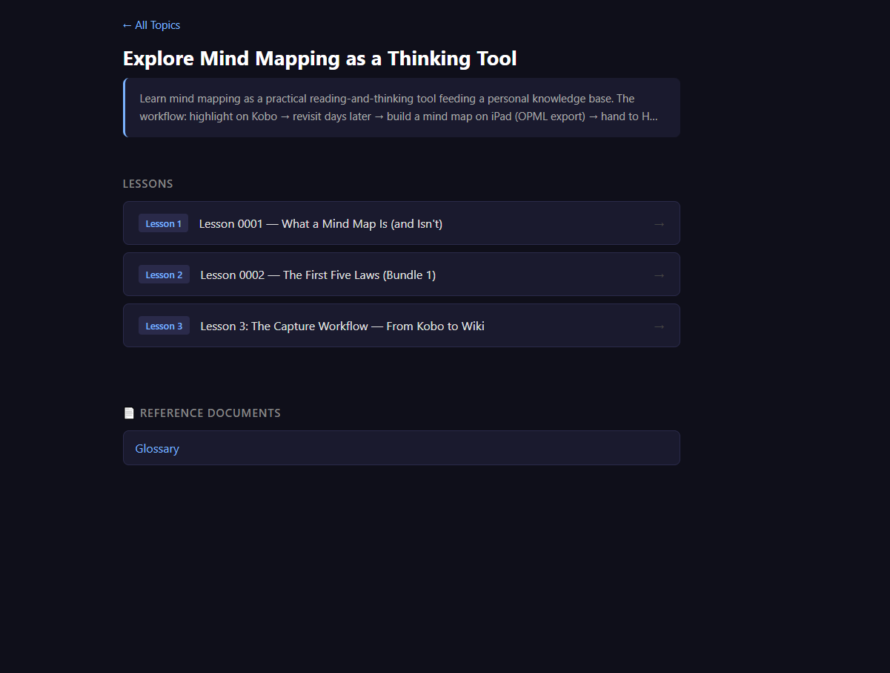
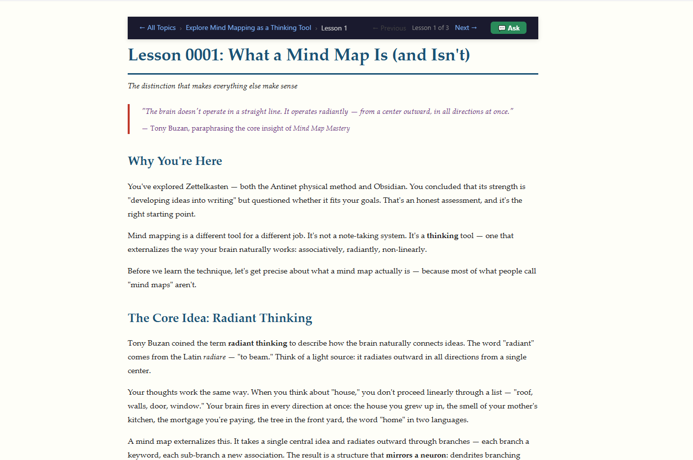
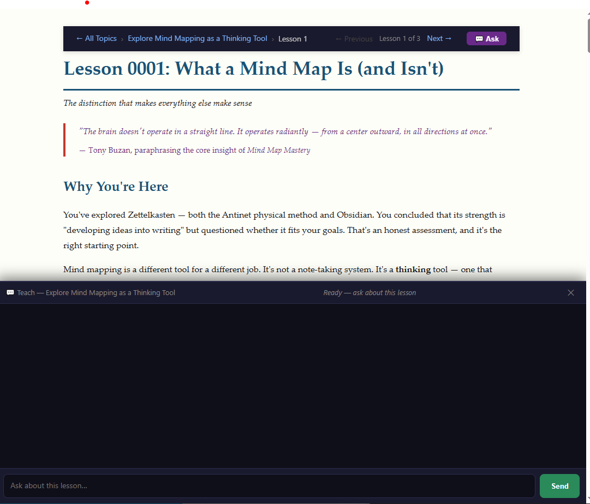

# 📚 Learn Portal

A lightweight web portal for browsing and **interacting with your `/teach`
learning workspaces** on a headless [Hermes Agent](https://hermes-agent.nousresearch.com)
server. It scans your workspace directories, lists every topic as a card, serves
wrapped lesson views in the browser — and adds a **💬 Ask** assistant to every
lesson so you can continue the learning conversation right where the lesson
stopped.

No database. No external services. Just the filesystem and your Hermes CLI.

```
┌─────────────────────────────────────────────────────┐
│  📚 Learn Portal                                    │
│                                                     │
│  ┌──────────────────┐  ┌──────────────────────────┐ │
│  │  🖨️ Resin 3D     │  │  🏗️ SAFe Learning       │ │
│  │  Printing        │  │  1 lesson · 1 reference  │ │
│  │  1 lesson        │  │  Latest: RTE Role &      │ │
│  │  Latest: Intro   │  │  Mindset                 │ │
│  │  to Resin 3D...  │  │                          │ │
│  └──────────────────┘  └──────────────────────────┘ │
└─────────────────────────────────────────────────────┘
```

## Screenshots

| Home — every workspace as a card | Topic & lesson views | 💬 Ask /teach pane |
|---|---|---|
|  |  ·  |  |

The **💬 Ask** pane (right) is the standout: an always-open chat assistant on every
lesson that continues the `/teach` conversation inline, backed by a one-shot
Hermes Agent subprocess returning your workspace's real teaching text.

## Features

- **Discover** — scans for `/teach` workspaces on every request; nothing to
  index or rebuild, new topics appear on the next page load.
- **Browse** — home page shows every workspace as a card (lesson count + latest
  lesson title); click through to the full lesson list and reference docs.
- **Learn** — lesson pages are the original authored HTML, wrapped with a thin
  sticky navbar (breadcrumbs + prev/next arrows) via three surgical DOM
  injections.
- **💬 Ask** — every lesson has a lower-half chat pane backed by a WebSocket
  to the portal. It continues the Hermes `/teach` session for that topic, so
  you can ask follow-up questions and go deeper *inside* the lesson you're
  reading. The pane is lazy: it only spawns a Hermes turn when you open it and
  send a message.

---

## Dependencies

Two layers, and **both are required** for a fully working install:

**1. Python (read-only portal)**
- Python 3.11+
- `fastapi`, `uvicorn[standard]`, `jinja2`, `markdown` (see `requirements.txt`)
- (Optional but recommended) [`uv`](https://docs.astral.sh/uv/) for fast installs

**2. Hermes Agent CLI (interactive 💬 Ask)**
- The [Hermes Agent](https://hermes-agent.nousresearch.com) CLI must be
  installed and on `PATH` — the portal shells out to `hermes chat` for the Ask
  pane. Startup resolves it with `shutil.which("hermes")`.
- You need a **model route configured** in Hermes (the sample box runs a local
  gateway named `9Router` exposing the `Deepseek` combo). Without a reachable
  model, lesson *browsing* still works, but the Ask pane can't answer.

> **Configurable paths.** The repo defaults to scanning workspaces under
> `/mnt/data/Workspace/Learning` and, for the Ask feature, expects a Hermes
> home at `/home/hermes-agent/.hermes`. These are read from environment
> variables (defaults shown in the Configuration table below), so you can point
> the portal at a different root or Hermes home without editing source. The
> spawned `hermes` subprocess borrows the same `HERMES_HOME`/`HOME` env the
> portal runs with, so it authenticates as the same user. Set the vars in the
> systemd unit (or `app.py` defaults) for a different layout.

---

## How It Works

### Reads (no writes, no DB)

On every request the portal scans `/mnt/data/Workspace/Learning/*/MISSION.md`
to discover teaching workspaces. It extracts the display title and a short
preview from each `MISSION.md`, and lists each workspace's `lessons/`
(numbered `N-title.html`) and `reference/` docs. All state lives on the
filesystem — there is no database to maintain.

### Lesson Wrapping

Each lesson keeps its original content, styles, and interactive scripts
intact. The portal makes three surgical injections at serve time:

1. A `<base>` tag so relative asset URLs (`../assets/style.css`) resolve
   correctly under the portal route.
2. Portal navbar styles, scoped with `.lp-` prefixes to avoid clashing with
   the lesson's own CSS.
3. A sticky navigation bar as the first child of `<body>`, with breadcrumbs
   and prev/next arrows.

### 💬 Ask — the interactive teach pane (WebSocket)

This is the notable piece. Each lesson's navbar has an **💬 Ask** button that
slides a chat pane up from the bottom. When you send a message:

1. The browser opens a WebSocket to `/chat/{topic}`.
2. The portal resolves the topic's existing Hermes session (seeding a fresh
   `/teach` conversation on first use).
3. The portal spawns one **one-shot, non-interactive** `hermes chat -Q`
   subprocess per message (`-Q` = quiet mode) targeting that topic's workspace,
   with a bounded timeout (`LP_TEACH_TIMEOUT`, default 240 s) so a hung turn
   never wedges the pane.
4. It captures the streamed reply, strips Hermes' CLI chrome (resume banner,
   `session_id:` dump, box-drawing borders, footer) down to the **teaching
   prose only**, and pushes it back over the socket as an incremental delta.
5. The subprocess exits; the next message spawns a fresh one, resuming the
   same session by ID.

The design is deliberately **stateless on the server** — no long-lived agent,
no active model connection held open. Every message is an ephemeral
spawn → ask → reply → exit. This keeps the portal light and makes crashes
self-healing (a hung turn dies at the timeout instead of blocking the server).

---

## Architecture

```
Browser  ── HTTP ───────────▶  FastAPI (app.py)  ──reads fs──▶  /mnt/data/Workspace/Learning/{topic}/
  │                                │                                          ├─ MISSION.md
  │                                │ scan/discover/index                       ├─ lessons/N-title.html
  │                                │                                          └─ reference/*.html
  │   lesson.html (wrapped)        │
  │                                │
  │  ── WebSocket /chat/{topic} ─▶ │
  │                                │   resolves session id
  │                                │   spawns (per message):
  │                                │      hermes chat -Q --resume <id> --skills teach
  │                                │          │
  │                                │          ▼  (one-shot subprocess, cwd=topic)
  │                                │      +────────────────────────────+
  │                                │      │  Hermes Agent CLI          │ ──▶  model route
  │                                │      │  (teach skill, quiet mode) │      (e.g. 9Router→Deepseek)
  │                                │      +────────────────────────────+
  │                                │          │ stdout
  │                                │          ▼
  │                                │   clean chrome → teaching prose
  │   delta / done                 │
  │◀──────────────────────────────│
```

Key properties:

- **One-shot subprocess per message** — no held connections, no server-side
  agent state, crash-resistant.
- **Quiet-mode + chrome stripping** — the pane shows only the answer's teaching
  prose, never Hermes' CLI noise.
- **Environment pinning** — `_hermes_env()` sets `HOME`, `HERMES_HOME`, and
  `HERMES_REAL_HOME` so the subprocess authenticates as the same user (and
  model route) as an interactive shell, instead of as an anonymous `openai`
  fallback.
- **Auto-reconnect** — if the WebSocket drops (e.g. the server restarts), the
  pane reconnects with exponential backoff instead of requiring a manual
  re-open.

---

## Prerequisites

- Linux server with `systemd --user` available
- Python 3.11+
- Hermes Agent CLI on `PATH` (for the 💬 Ask feature) and a configured model route

## Quick Start

```bash
# 1. Clone the repo on your Hermes server
git clone https://github.com/davelandrygmail/learn-portal.git
cd learn-portal

# 2. Run the install script (installs deps + sets up systemd service)
chmod +x install.sh
./install.sh

# 3. Open in your browser
#    Local:    http://localhost:7777
#    Network:  http://<server-ip>:7777
```

## Manual Start (without systemd)

```bash
# Install deps
uv pip install -r requirements.txt
# or: pip install -r requirements.txt

# Run the server (uses the project venv created by install.sh / pip)
.venv/bin/uvicorn app:app --host 0.0.0.0 --port 7777
```

> The server binds `0.0.0.0`. On a multi-user or internet-facing host, put a
> reverse proxy / auth in front, or use `--host 127.0.0.1` for local-only.

## Routes

| Path | What it shows |
|---|---|
| `/` | Home — all workspaces as cards |
| `/{topic}/` | Topic detail — lesson list + references |
| `/{topic}/lessons/{n}` | Wrapped lesson with navigation + Ask pane |
| `/{topic}/reference/{f}` | Raw reference doc (no wrapping) |
| `/health` | JSON health check |
| `/chat/{topic}` | **WebSocket** — Ask/teach channel (💬 Ask pane) |

## Configuration

| Knob | Default | Meaning |
|---|---|---|
| `LP_TEACH_TIMEOUT` (env) | `240` | Seconds a `hermes chat` turn may run before it's killed and reported as timed out. |
| `LP_WORKSPACE_ROOT` (env) | `/mnt/data/Workspace` | Root of the workspace tree; the portal mounts it at `/ws`. |
| `LP_LEARNING_DIR` (env) | `$LP_WORKSPACE_ROOT/Learning` | Directory containing the `/teach` workspaces. |
| `LP_HERMES_HOME` (env) | `/home/hermes-agent/.hermes` | Hermes config/auth home passed to each spawned `hermes` subprocess. |
| `LP_HERMES_REAL_HOME` (env) | `/home/hermes-agent` | Real home forwarded to the `hermes` subprocess. |
| `LP_HERMES_BIN` (env) | `which hermes` | Explicit path to the `hermes` CLI; falls back to `PATH`, then `/home/hermes-agent/.local/bin/hermes`. |

## File Structure

```
learn-portal/
├── app.py              # FastAPI app: discovery, lesson wrapping, WS /teach bridge
├── templates/
│   ├── index.html      # Home page
│   └── topic.html      # Topic detail page
├── static/
│   └── teach-chat.js   # 💬 Ask pane (WebSocket client, auto-reconnect)
├── requirements.txt    # Python dependencies
├── install.sh          # One-shot setup script
└── README.md           # This file
```

## Managing the Service

```bash
# Status
systemctl --user status learn-portal.service

# Stop / start / restart
systemctl --user stop learn-portal.service
systemctl --user start learn-portal.service
systemctl --user restart learn-portal.service

# Live logs
journalctl --user -u learn-portal.service -f

# Disable on boot
systemctl --user disable learn-portal.service
```

## Adding a New Workspace

Just create a new subdirectory in `/mnt/data/Workspace/Learning/` with a
`MISSION.md` and a `lessons/` directory using the `/teach` skill. The portal
picks it up automatically on the next page load — no config, no restart.
